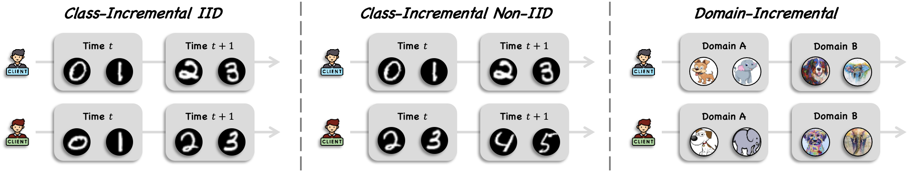
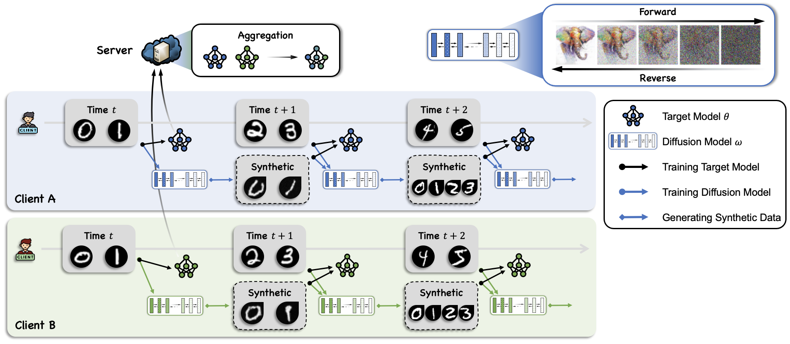

## Continual Federated Learning with Conditional Diffusion Models as Replay

[](https://www.python.org/downloads/release/python-31012/)
[](https://opensource.org/licenses/MIT) 

-----------------------------------------------------------------------------------------------

NeurIPS 2024, Submission 5599

-----------------------------------------------------------------------------------------------

## ♻️ Three Continual Federated Learning Scenarios



- **Class Incremental IID:** Clients have an identical class distribution, with classes incrementing over time.
- **Class Incremental Non-IID:** Clients have a non-identical class distribution, with classes incrementing over time.
- **Domain Incremental:** Clients data domain changes over time.

## Our Framework



Each client has a target model and a diffusion model, both trained on the same dataset, consisting of the previous time period's real and synthetic data. The target model is uploaded to the server for aggregation, while the diffusion model remains local to prevent privacy leakage. The trained diffusion model will generate synthetic data encompassing all previously acquired knowledge.

## Prerequisites
Please download packages via `pip install -r requirements.txt` or below
```
* python == 3.10.12
* einops==0.7.0
* labml-helpers==0.4.89
* labml-nn==0.4.136
* numpy==1.23.5
* torch==2.2.2
* torchvision==0.17.2
```

## Dataset

For the MNIST, Fashion-MNIST, and CIFAR-10 datasets, they can all be downloaded through torchvision.datasets. You don't need to do anything! 
For the PACS dataset, please refer to the official webpage of [PACS dataset](https://dali-dl.github.io/project_iccv2017.html).

## Folder Structure
```
DCFL/
│   README.md
│   requirements.txt    
│
└─── main/
    │   CFL_CD.py
    │   load_dataset.py
    │   models.py
    │   options.py
    └─── data/
        └─── PACS/ -- Put the downloaded PACS dataset here
│
└─── MNIST/
    │   {args.task}_CFL_{args.dataset}_{args.framework}.npy -- saved results here
    └─── model/
        │   Diffusion_{args.task}_CFL_{args.dataset}_{args.framework}.pth -- saved models here
│
└─── FashionMNIST/
└─── CIFAR10/
└─── PACS/
```

- `main/` the main folder
-- `CFL_CD.py` is our framework code
-- `models.py` is models' code, including CNNs, conditional UNet, and diffusion model
-- `options.py` specifies CFL scenarios, data sets and other parameters

- `data/` stores all datasets

- `MNIST/`, `FashionMNIST/`, `CIFAR10/`, and `PACS/` are used to save training results and trained models

## Run Code
```
python CFL_CD.py --device='cuda:0' --framework='CFL_CD' --task='Class_IID' --dataset='MNIST'
```

## Acknowledgement

The original implementations of DDPM and UNet are sourced from [labml_nn](https://nn.labml.ai/diffusion/ddpm/index.html).


